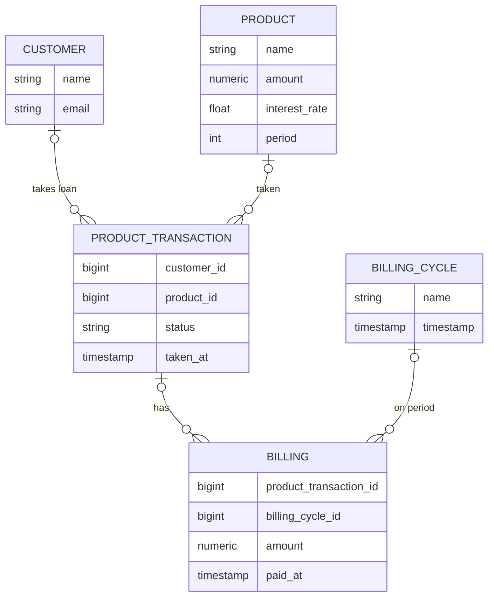
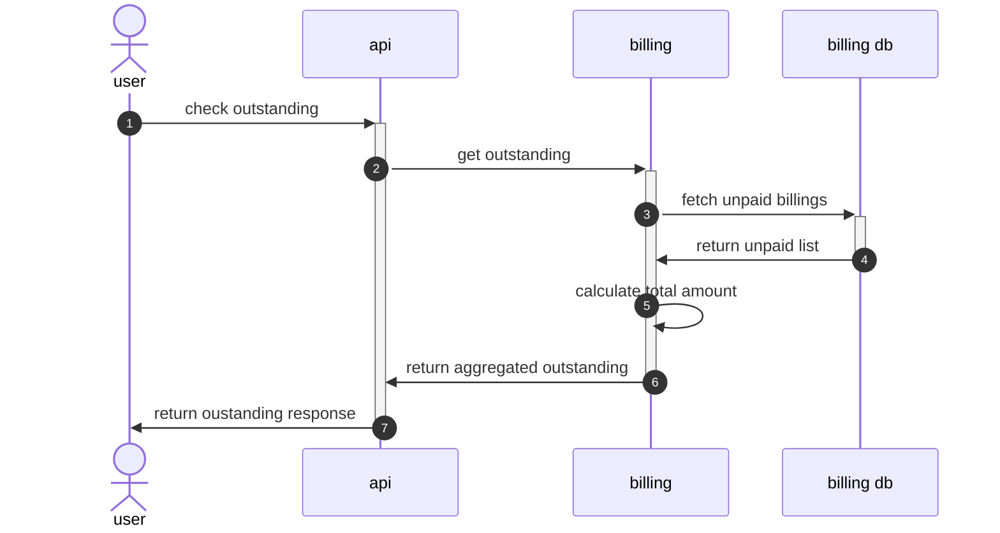
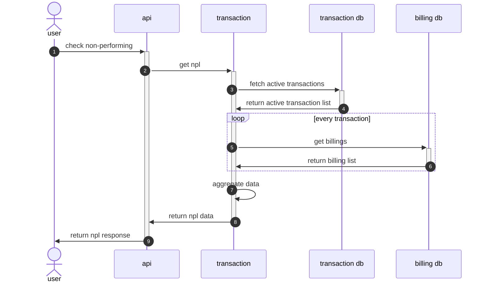
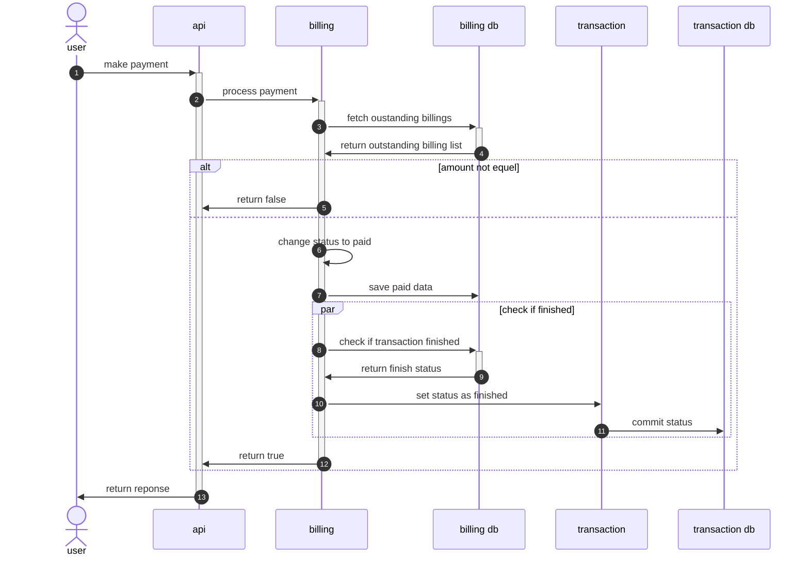
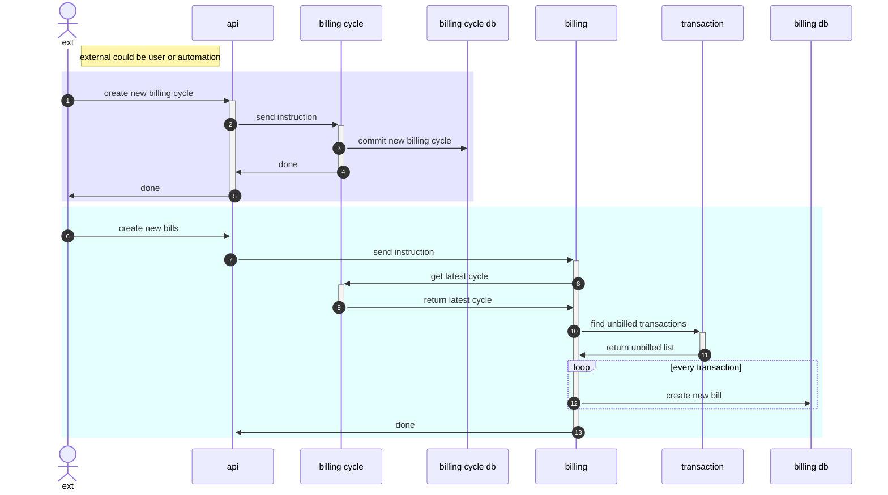

# Simple Billing Engine for Loaning

This project is to demonstrate a simple billing engine. The billing engine is a RESTful service that handles loaning product.

## Technologies
1. Java 21
    - a bit of virtual threads
2. Spring Boot 3.3.4
    - MVC
3. Maven
4. Junit 5
5. H2 DB
   - MySQL (Optional)
6. Docker

## How to run (on Docker)
1. Enable Docker on your machine
2. Run the following command to build the project:
    ```bash
    ./bin/setup
    ```
3. Run the following command to start the project:
    ```bash
    ./bin/run $port
    ```
   Default port is 8080 if not provided

### Using MySQL
1. Enable Docker on your machine
2. Run the following command to build the project:
    ```bash
    ./bin/setup-mysql
    ```
3. Run the following command to start the project:
    ```bash
    ./bin/run 8080 mysql
    ```

## Architecture

1. Basically this system has 2 basic entities, `Customer` and `Product`.
   - `Customer` is the one who takes the loan, while `Product` is the loan product. 
   - The loan `Product` has a fixed amount, interest rate, and period (in week).
   - There are multiple loan `Product`.
   - One customer can take multiple loan `Product`.
2. The loan product is taken by the customer through `ProductTransaction`. 
   - The `ProductTransaction` is the transaction that connects `Customer` and `Product`. 
   - The `ProductTransaction` has a status that indicates the transaction status. 
3. The transaction is billed through `Billing`.
   - The `Billing` is the billing information that connects `ProductTransaction` and `BillingCycle`.
4. The `BillingCycle` is the billing period.

### Entity Relationship Diagram (ERD)


### Logic Flow (Sequence Diagram)
#### Get Outstanding Bill

#### Check Non-Performing Loan (NPL)


#### Make Payment


#### Create new billing


## APIs
### Create Customer
```bash
curl --location 'http://localhost:8080/api/v1/billing/customer' \
--header 'Content-Type: application/json' \
--data-raw '{
  "name": "Person A",
  "email": "a@email.com"
}'
```
### Create Loan Product
```bash
curl --location 'http://localhost:8080/api/v1/billing/product' \
--header 'Content-Type: application/json' \
--data '{
  "name": "Loan A",
  "amount": 5000000,
  "interestRate": 10,
  "period": 50
}'
```
### Take Loan
```bash
curl --location 'http://localhost:8080/api/v1/billing/transaction' \
--header 'Content-Type: application/json' \
--data '{
  "customerId": 1,
  "productId": 1
}'
```
### Create Billing Cycle
```bash
curl --location --request POST 'http://localhost:8080/api/v1/billing/billing-cycle'
```
### Create Billings
```bash
curl --location --request POST 'http://localhost:8080/api/v1/billing'
```
### Get Outstanding Bill
```bash
curl --location 'http://localhost:8080/api/v1/billing/outstanding?trxId=1'
```
### Make Payment
```bash
curl --location 'http://localhost:8080/api/v1/billing/payment' \
--header 'Content-Type: application/json' \
--data '{
  "productTransactionId": 1,
  "amount": 110000.00
}'
```
### Check Non-Performing Loan (NPL)
```bash
curl --location 'http://localhost:8080/api/v1/billing/transaction/npl?customerId=1'
```

## Misc

1. Complete API contract:
   - Swagger UI: http://localhost:8080/swagger-ui.html

---
&copy; 2024 Andreas Arifin
